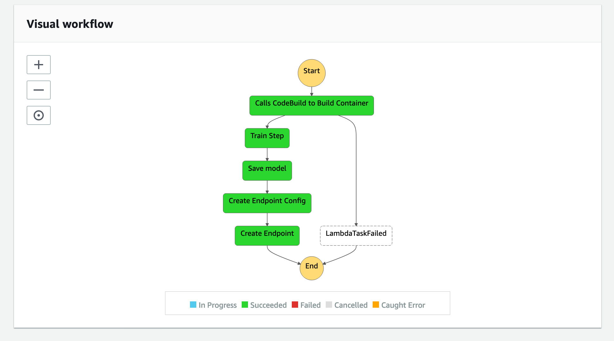

# Build, Train and Deploy your own Mask R-CNN container to Amazon SageMaker using AWS StepFunctions Data Science SDK. 


This workshop demonstrates how to use the StepFunction Data Science SDK to build train and deploy your own container in Amazon
SageMaker using only Python Code. This enables data scientists to develop Continuous Integration/Continuous Delivery (CI/CD) pipelines
into their workflow. 

The overall flow of this workshop is as follows:

1/ Upload your code to the Lambda console. This is the mask_r_cnn folder, Dockerfile, buildspec.yml and lambda_function.py <br/>
2/ Use StepFunctions pipeline to kick off the Lambda function which in-turn will launch a CodeBuild job to build your Mask R-CNN Docker container with your custom code <br/>
3/ CodeBuild will upload the Docker container to Amazon ECR for your use.<br/>
4/ The StepFunctions Training pipeline will pick up this Docker container, train the model and deploy it. <br/>

**Note** that in order to train a Mask R-CNN model, we use an ml.p3.2xlarge instance with a training time of roughly 320 seconds. 
This will incur a cost of $0.38 for training the model.


# Step 1: Deploy this CloudFormation template

This Cloudformation template creates a Lambda function with a sample Dockerfile that launches a Codebuild job
to build a Sagemaker specific container. 

Launch CloudFormation stack in us-east-1: [](https://console.aws.amazon.com/cloudformation/home?region=us-east-1#/stacks/create/template?stackName=lambda-docker-build-maskrcnn&templateURL=https://lambda-ml-layers.s3.amazonaws.com/lambda-sm-build-maskrcnn.yaml)

If you would like to edit this ^ cloud formation template before deploying, you may download it from [here](https://lambda-ml-layers.s3.amazonaws.com/lambda-sm-build-maskrcnn.yaml)

SageMaker Containers gives you tools to create SageMaker-compatible Docker containers, and has additional tools for letting you create Frameworks (SageMaker-compatible Docker containers that can run arbitrary Python or shell scripts). 

# Step 2: Clone this repo to your SageMaker Notebook instance
```bash
git clone https://github.com/aws-samples/aws-stepfunctions-byoc-mlops-using-data-science-sdk.git
```

# Step 3: Run the Jupyter Notebook.

Create a new SageMaker notebook instance and clone this repo. 

Run through the *StepFunctions_BYOC_Workflow.ipynb*. Open up the StepFunctions Console to watch the individual steps in the graph getting executed.



At the end of this workshop, you should have a deployed SageMaker endpoint that you can use to call inferences on your model.

# Next Steps

While the example we demonstrate here works for Mask R-CNN, with simple modificiations, you can use this to bring your own algorithm
container to Amazon SageMaker. For precise steps on how to modify your container code to work on Amazon SageMaker, we refer you
to this Github repo: https://github.com/awslabs/amazon-sagemaker-examples/tree/master/advanced_functionality/scikit_bring_your_own.

This repo demonstrates how to package your training and inference code, and Dockerfile in a format that is compatible with SageMaker. For the Mask R-CNN workshop here, this has already been done for you. 

Enjoy building your own CI/CD pipelines with Amazon SageMaker, AWS Lambda, AWS StepFunctions.

## License

This library is licensed under the MIT-0 License. See the LICENSE file.
